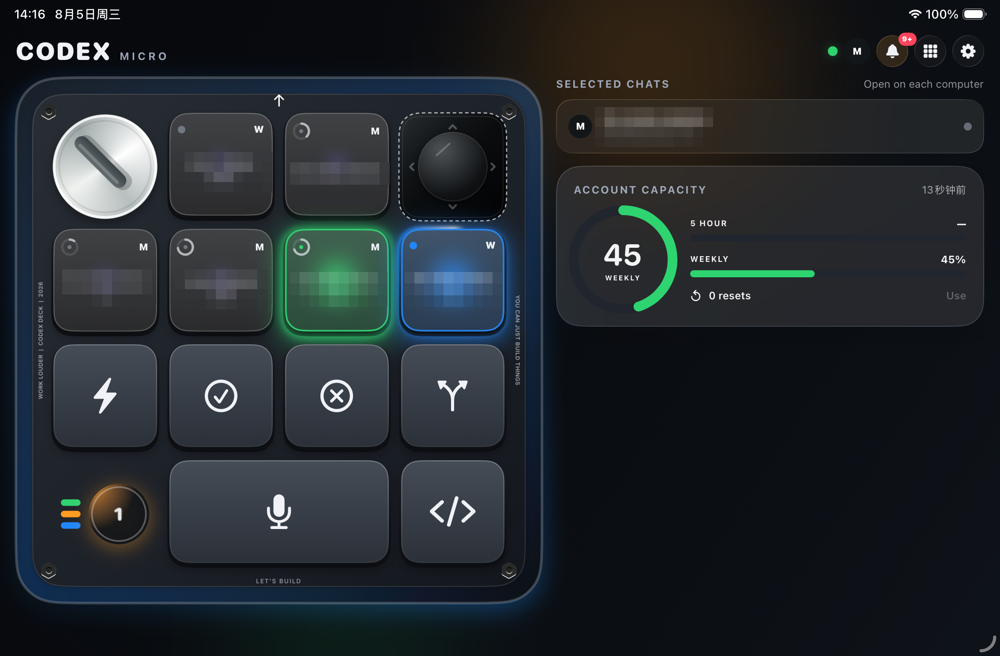
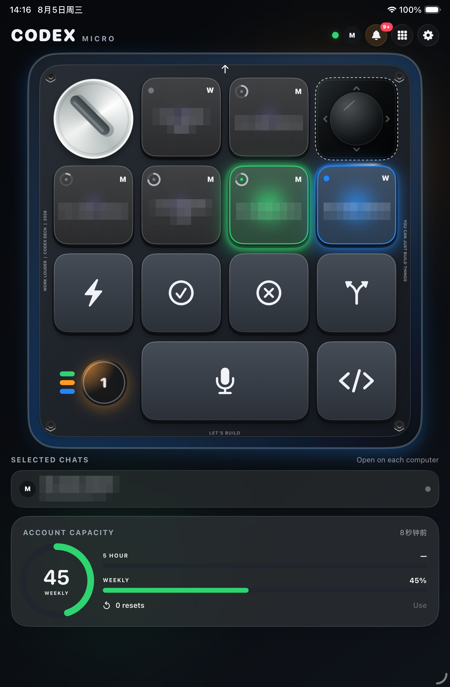

# Codex Deck iPad

Turn an iPad into a **Codex Micro** — a physical-feeling control deck for the OpenAI Codex desktop app. Monitor six agent threads at a glance, approve or reject from the couch, dispatch dictation, and watch working agents light up with a chasing LED ring.

Based on [dazer1234/codex-stream-deck](https://github.com/dazer1234/codex-stream-deck) (MIT), which pairs Codex with an Elgato Stream Deck and an iPhone companion app. This project keeps all of that and rebuilds the mobile experience around the iPad, plus compatibility fixes for current Codex desktop builds.

> [!IMPORTANT]
> This is an independent community project. It is not made, supported, or endorsed by OpenAI or Elgato. It uses undocumented Codex desktop internals and may need an update after a Codex release.

<p align="center">
  
</p>
<p align="center">
  
</p>

## What's different here

**iPad-first UI**

- Hardware-style **square keycaps** sized so four columns fill the enclosure edge to edge, with real key travel (the top face sinks into a darker side skirt when pressed).
- **Frosted translucent agent keys** with the RGB switch glowing through from underneath — a faint purple ember when idle, a full status flood when live.
- **Working animation**: a clockwise LED comet chases around the key edge while an agent is busy, so "running" and "needs you" are distinguishable across the room.
- **Dictation UX**: the mic key is tap-to-start / tap-to-stop and shows a listening state (animated red waveform + breathing red border) while the Mac records. Long-press-to-replace is disabled on the mic key so it never fights the toggle.
- **Landscape split view**: keyboard pinned at full height on the left, chats and account capacity in a column on the right. Portrait pins the keyboard on top. On iPad the page never scrolls — only the info column does, so key presses can't shove the layout around.
- **Focus follow**: selecting a thread from the iPad raises the Codex window on the Mac so the switch is visible.

**Codex 26.7x compatibility fixes** (reported upstream in [codex-stream-deck#11](https://github.com/dazer1234/codex-stream-deck/issues/11))

- The MIC keycap became a `named` native action with no importable command module; it is now driven through the native HID dictation key.
- Sidebar thread ids gained a `local:` prefix while the composer attribute stayed a bare uuid, making every remote thread selection report a false failure; ids are now normalized before comparison.

Everything else — the Stream Deck plugin, Windows support, multi-host relay, Tailscale remote access, the security model — is inherited unchanged from upstream. See the docs below.

## Quick start (Mac + iPad)

1. **Mac launcher** — build and install the watcher:

   ```sh
   npm install && npm run build
   cd release/codex-deck-launcher-macos
   ./start-codex-deck.sh start     # restarts Codex with a loopback CDP bridge
   ./start-codex-deck.sh install   # persistent LaunchAgent
   ```

2. **Pair the iPad (same Wi-Fi)**:

   ```sh
   ./start-codex-deck.sh mobile-local-config   # shows a QR code
   ```

3. **iPad app** — source-only, signed by you (needs Xcode; iPadOS 17+):

   ```sh
   ./scripts/configure-ios-signing.sh com.yourname.CodexDeckMobile <TEAM_ID>
   xcodebuild -project ios/CodexDeckMobile.xcodeproj -scheme CodexDeckMobile \
     -destination 'platform=iOS,id=<device-udid>' -allowProvisioningUpdates build
   xcrun devicectl device install app --device <device-udid> <path-to-built-app>
   ```

   Open the app, allow Local Network, scan the QR code.

4. **Optional — survive IP changes / control from anywhere** with Tailscale:

   ```sh
   ./start-codex-deck.sh relay-config 127.0.0.1
   tailscale serve --bg --https=47651 http://127.0.0.1:47651
   ```

   Pair `wss://<mac-name>.<tailnet>.ts.net:47651` with the printed token in the app.

Detailed guides: [macOS](docs/MACOS.md) · [iPhone/iPad app](docs/IOS.md) · [install from source](docs/IOS_INSTALL.md) · [Windows](docs/WINDOWS.md) · [multi-host](docs/MULTI_HOST.md) · [troubleshooting](docs/TROUBLESHOOTING.md)

## 中文简介

把 iPad 变成 Codex Micro 硬件宏键盘的软件替代:方形磨砂键帽复刻实体键手感、六路 agent 状态灯(工作中 = 蓝色流光环绕、待批准 = 橙色常亮)、点按开关的远程听写、横屏仪表盘布局、切线程自动把 Mac 上的 Codex 窗口调到最前。同时修复了 Codex 26.7x 桌面版的两个兼容性问题(语音键帽与线程选择)。基于 [codex-stream-deck](https://github.com/dazer1234/codex-stream-deck)(MIT)。

## License

MIT. Original work © 2026 Dazer ([codex-stream-deck](https://github.com/dazer1234/codex-stream-deck)); iPad adaptation and Codex 26.7x fixes © 2026 Haokun Bi. See [LICENSE](LICENSE).

Codex, ChatGPT, and Codex Micro are trademarks of their respective owners. This is an unofficial community project; no official artwork is bundled.
